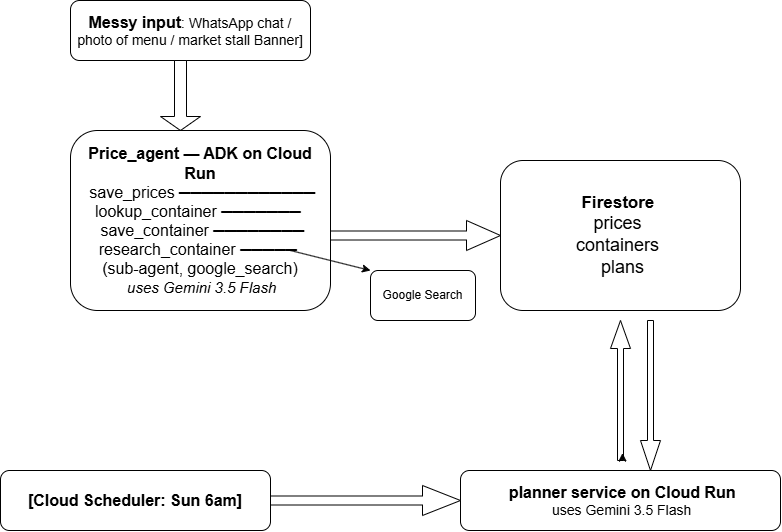

# ChopChop

**Nigerian pidgin for eating well.** An agent that reads messy market
price data, resolves local container units nobody has digitised, and
plans a household's week within a naira budget — on its own, every
Sunday morning.

## The problem

Nigerian food prices are quoted in containers, not kilograms: a custard
bucket of rice, one painter of beans, half a paint of tomatoes. Prices
arrive as WhatsApp messages in pidgin, photos of chalkboards, and
half-remembered market quotes. None of it is structured, and no dataset
maps those containers to actual weights.

A household trying to feed five people on ₦20,000 a week has to hold all
of that in their head.

## What it does

1. **Ingests messy input** — WhatsApp pidgin, photos of price boards,
   spoken quotes. Extracts structured records with explicit confidence
   scores and issue flags. Refuses to guess: unstated units are flagged,
   not invented.
2. **Resolves unknown containers** — when it meets a container it has no
   mapping for, a research sub-agent searches the web, finds the
   disagreeing figures that exist, reconciles them, and writes the
   mapping to Firestore with the conflicting values and its reasoning
   preserved. It only learns each container once.
3. **Plans autonomously** — Cloud Scheduler triggers a planner service
   every Sunday at 6am Lagos time. It reads the price and container data,
   produces seven days of meals and a costed shopping list within budget,
   and writes the plan to Firestore. Nobody has to open anything.

## Example

Input (real WhatsApp message from a vendor):

> Food don cost for market now o oga. 1 custard bucket for rice na around
> 5k now, beans one painter dae around 5k for iron beans and 8k for brown
> beans...

The agent splits the beans clause into two records with different grades,
flags every price as hedged because the vendor said "around", scores
confidence accordingly, and discovers it doesn't know what a custard
bucket holds.

It then researches and finds a genuine spread — nine distinct figures for
a custard bucket of garri, from 1.5kg to 4kg. It resolves to 2.5kg with
confidence 0.55, because the sources disagreed. A custard bucket of rice
resolves to 4kg: same container, different density.

## Architecture



- **Gemini 3.5 Flash** via Vertex AI (`global` endpoint)
- **Agent Development Kit** — root agent with three function tools plus a
  research sub-agent wrapped as `AgentTool`, giving tool isolation and a
  clean delegation boundary
- **Cloud Run** — two services: the agent, and the planner
- **Firestore** — three collections: `prices`, `containers`, `plans`
- **Cloud Scheduler** — weekly autonomous trigger

## Setup

```bash
# 1. Enable APIs
gcloud config set project YOUR_PROJECT_ID
gcloud services enable run.googleapis.com cloudbuild.googleapis.com \
  artifactregistry.googleapis.com aiplatform.googleapis.com \
  firestore.googleapis.com cloudscheduler.googleapis.com

# 2. Create Firestore
gcloud firestore databases create --location=nam5 --type=firestore-native

# 3. Deploy the agent
pip install google-adk
adk deploy cloud_run --project=YOUR_PROJECT_ID --region=us-central1 \
  --service_name=chopchop --with_ui ./price_agent

gcloud run services update chopchop --region=us-central1 \
  --update-env-vars GOOGLE_CLOUD_LOCATION=global,\
GOOGLE_GENAI_USE_VERTEXAI=TRUE,GOOGLE_CLOUD_PROJECT=YOUR_PROJECT_ID

# 4. Deploy the planner
cd planner_service
gcloud run deploy chopchop-planner --source . --region=us-central1 \
  --allow-unauthenticated \
  --set-env-vars GOOGLE_CLOUD_PROJECT=YOUR_PROJECT_ID,\
GOOGLE_CLOUD_LOCATION=global,GOOGLE_GENAI_USE_VERTEXAI=TRUE

# 5. Schedule it
gcloud scheduler jobs create http chopchop-weekly \
  --location=us-central1 --schedule="0 6 * * SUN" \
  --time-zone="Africa/Lagos" \
  --uri="https://YOUR_PLANNER_URL/weekly-plan" --http-method=POST
```

Note: Gemini 3.x models are served from the `global` Vertex endpoint, not
regional ones. Setting `GOOGLE_CLOUD_LOCATION=us-central1` will 404.

## Files

- `price_agent/agent.py` — root agent and research sub-agent
- `price_agent/prompts.py` — extraction rules, confidence calibration,
  container disambiguation
- `price_agent/tools.py` — Firestore read/write tools
- `planner_service/` — scheduled weekly planner

## Limitations

- Price data covers one market. Coverage, not method, is the constraint.
- Container weights are researched but genuinely contested; confidence
  scores reflect real source disagreement rather than certainty.
- Voice input works via Gemini's native audio handling but is lightly
  tested for Nigerian Pidgin.
- Figures are for household budgeting, not nutritional or clinical use.
